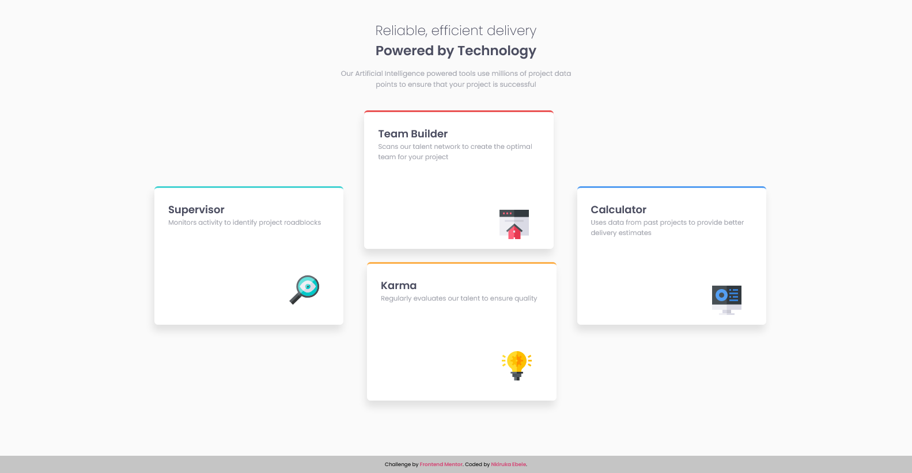
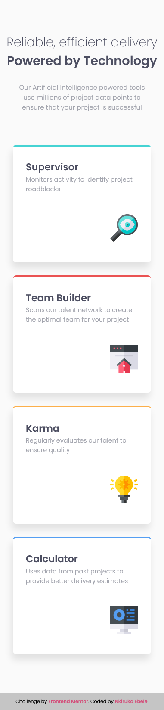

# Frontend Mentor - Four card feature solution

This is a solution to the [Sunnyside agency landing page challenge on Frontend Mentor](https://www.frontendmentor.io/challenges/four-card-feature-section-weK1eFYK). Frontend Mentor challenges help you improve your coding skills by building realistic projects.

## Table of contents

- [Overview](#overview)
  - [The challenge](#the-challenge)
  - [Screenshot](#screenshot)
  - [Links](#links)
- [My process](#my-process)
  - [Built with](#built-with)
- [Author](#author)

## Overview

### The challenge

Users should be able to:

- View the optimal layout for the site depending on their device's screen size
- See hover states for all interactive elements on the page

### Screenshot

### Links

- Solution URL: [Frontend Mentor](https://www.frontendmentor.io/solutions/responsice-fourcard-section-with-html-and-css-Hd79vb1MXT)
- Live Site URL: [Github Pages](https://nkirukka.github.io/submodules/four-card-feature/)

## My process

### Built with

- Semantic HTML5 markup
- CSS custom properties
- Flexbox
- Mobile-first workflow

## Author

- Website - [Nkiruka Ebele](linkedin.com/in/nkiruka-ebele-8b03bb17a)
- Frontend Mentor - [@nkirukka](https://www.frontendmentor.io/profile/nkirukka)